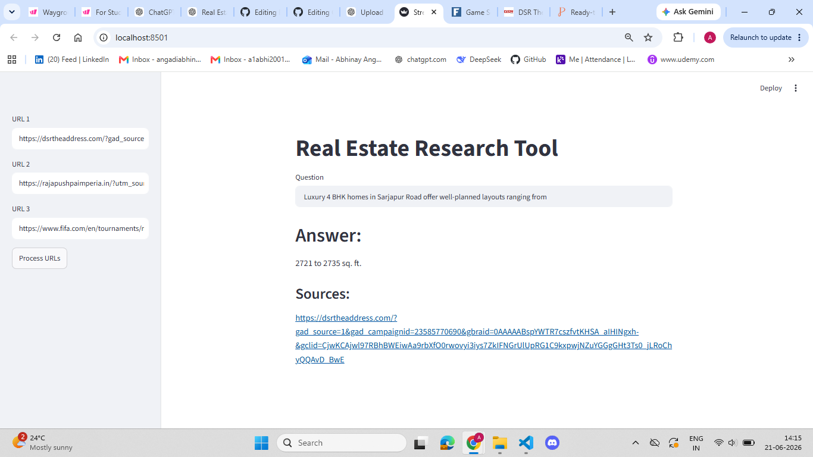

# 🏠 Real Estate Assistant using RAG


An end-to-end **Retrieval-Augmented Generation (RAG) Application** that enables users to ask natural language questions about real estate properties and receive accurate, context-aware responses using Large Language Models, Vector Databases, and Semantic Search.

The system retrieves relevant property information from a custom knowledge base and generates intelligent responses grounded in retrieved documents.

---

# 📌 Project Overview

Traditional property search platforms rely on keyword matching and structured filters. Users often struggle to find specific information buried within property listings, descriptions, and real estate documents.

This project builds a complete RAG pipeline that:

* Loads real estate data from CSV files and web sources
* Splits large documents into meaningful chunks
* Generates embeddings for semantic understanding
* Stores embeddings in a ChromaDB vector database
* Retrieves relevant property information
* Generates context-aware responses using an LLM
* Provides an interactive Streamlit interface

---

## 📸 Application Screenshots

### Home Page



---

## 🚀 Features

* Natural language property search
* Semantic similarity-based retrieval
* Retrieval-Augmented Generation (RAG)
* ChromaDB vector database integration
* Real estate knowledge base support
* Fast and context-aware responses
* Streamlit-based web application
* Scalable architecture for additional property datasets

---

## 🎯 Problem Statement

Finding relevant property information often requires users to browse through multiple listings and documents manually.

This system allows users to ask questions such as:

> "Show apartments in Bangalore under ₹1 Crore."

> "What amenities are available in Property X?"

> "Compare two properties based on price and amenities."

The goal is to provide accurate answers by combining document retrieval with Large Language Models.

---

## 📊 Dataset Description

The project uses real estate data collected from:

* Property listing CSV files
* Real estate websites
* Market reports
* Property descriptions
* Builder and project information

### Sample Features

| Feature       | Description          |
| ------------- | -------------------- |
| Property Name | Name of Property     |
| Location      | Property Location    |
| Price         | Property Price       |
| Bedrooms      | Number of Bedrooms   |
| Area          | Property Area        |
| Amenities     | Available Facilities |
| Description   | Property Details     |

---

## 🔍 Data Processing Pipeline

### Document Loading

The system loads data using:

* CSVLoader
* UnstructuredURLLoader

### Text Chunking

Documents are divided into smaller chunks using:

* CharacterTextSplitter
* RecursiveCharacterTextSplitter

### Embedding Generation

Text chunks are converted into vector embeddings using:

* HuggingFace Embeddings

### Vector Storage

Embeddings are stored in:

* ChromaDB

### Retrieval

Relevant chunks are retrieved using:

* Similarity Search
* Semantic Search

### Generation

Retrieved context is passed to:

* Llama 3
* Groq API

for answer generation.

---

## 🧠 RAG Architecture

```text
User Query
     │
     ▼
Retriever
     │
     ▼
ChromaDB Vector Database
     │
     ▼
Relevant Chunks
     │
     ▼
LLM (Llama 3)
     │
     ▼
Generated Response
```

---

## ⚙️ Technologies Used

| Technology  | Purpose             |
| ----------- | ------------------- |
| Python      | Core Development    |
| LangChain   | RAG Framework       |
| ChromaDB    | Vector Database     |
| HuggingFace | Embeddings          |
| Groq        | LLM Inference       |
| Llama 3     | Response Generation |
| Streamlit   | Frontend            |
| Pandas      | Data Processing     |
| NumPy       | Numerical Computing |

---

## 📈 System Workflow

1. Load real estate documents.
2. Split documents into chunks.
3. Generate embeddings.
4. Store embeddings in ChromaDB.
5. User submits a query.
6. Retrieve relevant chunks.
7. Send retrieved context to LLM.
8. Generate final answer.
9. Display response through Streamlit.

---

## 📂 Project Structure

```text
Real_Estate_Assistant_RAG/
│
├── data/
│   ├── property_listings.csv
│
├── vector_db/
│   └── chroma_db
│
├── src/
│   ├── data_loader.py
│   ├── text_splitter.py
│   ├── embeddings.py
│   ├── vector_store.py
│   ├── rag.py
│
├── app.py
├── requirements.txt
├── README.md
└── .gitignore
```

---

## Setup Instructions

### 1. Clone Repository

```bash
git clone https://github.com/yourusername/Real_Estate_Assistant_RAG.git

cd Real_Estate_Assistant_RAG
```

### 2. Install Dependencies

```bash
pip install -r requirements.txt
```

### 3. Create Environment Variables

```bash
GROQ_API_KEY=your_api_key
```

### 4. Run the Application

```bash
streamlit run app.py
```

Application URL:

```text
http://localhost:8501
```

---

## 🛠 Tech Stack

* Python 3.10+
* LangChain
* ChromaDB
* HuggingFace Embeddings
* Groq API
* Llama 3
* Streamlit
* Pandas
* NumPy
* Jupyter Notebook
* Git & GitHub

---

## 💡 Key Learnings

* Understanding Retrieval-Augmented Generation (RAG)
* Working with Vector Databases
* Semantic Search Implementation
* Embedding Generation
* Context-Aware LLM Applications
* LangChain Framework Usage
* Prompt Engineering
* Streamlit Deployment

---

## 🔮 Future Enhancements

* Voice-Based Real Estate Assistant
* Property Recommendation Engine
* Multi-Language Support
* Image-Based Property Search
* Real-Time Property Updates
* Agentic AI Workflows
* Cloud Deployment (AWS/GCP/Azure)
* Multi-Document Reasoning

---

## 👨‍💻 Author

**Abhinay Angadi**

📧 Email: [angadiabhinay2001@gmail.com](mailto:angadiabhinay2001@gmail.com)

💼 LinkedIn: https://linkedin.com/in/abhinay-angadi-541004159

💻 GitHub: https://github.com/AngadiAbhinay01

---

## ⭐ If You Found This Project Helpful

If you found this project useful or learned something from it, please consider giving it a ⭐ on GitHub.

Your support helps improve visibility and motivates future AI & Generative AI projects!

---
